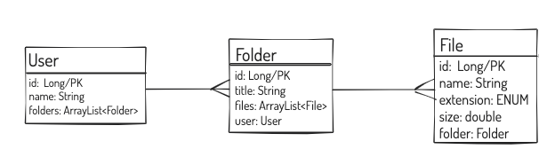

# Files and Folders: 

#### A one-to-many Spring application using Spring annotations

The application should have the following models: 
- [x] Folders
- [x] Files
- [x] Users
- [ ] Users should have many folders
- [ ] folders should have many files.
- [ ] need to create repositories for each entity.
- [ ] need to create controllers for each entity, too, and ensure they implement the index, create and show routes.
- [ ] A seeding file DataLoader component to pre-seed the database.
- [ ] Test the routes with Insomnia

# MVP
Create a system to track files and folders:

1. A File should have:
- [ ] a name
- [ ] extension (e.g. txt, rb, java, ppt)
- [ ] size
- [ ] folder
2. A User should have:
- [ ] name
- [ ] a list of folders
3. A Folder should have:
- [ ] a title
- [ ] list of files
- [ ] a user

## Planning:

